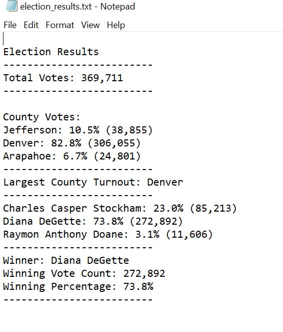
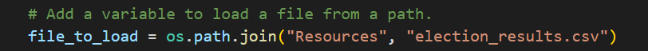
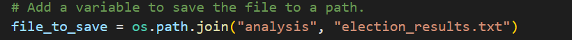

# Election_Analysis
## Overview of Election Audit 
### Purpose
This project is to help Tom and his manager, Seth to deliver the election results needed by the Colorado Board of Elections by using Python script. The dataset provided by Seth includes ballot ID, county and candidate name. The election results needed should include total number of votes in this dataset file, the percentage of votes each county won, and the percentage and number of votes each candidate won in the largest county turnout. More importantly, it shall show the winner’s name and the percentage and number of vote the winner won.  
## Election-Audit Results
### 1. Address the following election outcomes
* How many votes were cast in this congressional election?

    There were 369,711 votes cast in this congressional election. 
* Provide a breakdown of the number of votes and the percentage of total votes for each county in the precinct.
    
    County Votes:
    * Jefferson: 10.5% (38,855)
    * Denver: 82.8% (306,055)
    * Arapahoe: 6.7% (24,801)

* Which county had the largest number of votes?
    * Denver
* Provide a breakdown of the number of votes and the percentage of the total votes each candidate received.
    * Charles Casper Stockham: 23.0% (85,213)
    * Diana DeGette: 73.8% (272,892)
    * Raymon Anthony Doane: 3.1% (11,606)

* Which candidate won the election, what was their vote count, and what was their percentage of the total votes?
    * Winner: Diana DeGette
    * Winning Vote Count: 272,892
    * Winning Percentage: 73.8%

See the results: 


### 2. Examples of the codes to print out the candidate and county election results and saved the results in the txt. file.  
``` 
 # 4a: Write an if statement that checks that the
        # county does not match any existing county in the county list.
        if county_name not in counties:

            # 4b: Add the existing county to the list of counties.
            counties.append(county_name)

            # 4c: Begin tracking the county's vote count.
            county_votes[county_name] = 0


# Save the results to our text file.
with open(file_to_save, "w") as txt_file:

    # Print the final vote count (to terminal)
    election_results = (
        f"\nElection Results\n"
        f"-------------------------\n"
        f"Total Votes: {total_votes:,}\n"
        f"-------------------------\n\n"
        f"County Votes:\n")
    print(election_results, end="")

    txt_file.write(election_results)


 # Print the winning candidate (to terminal)
    winning_candidate_summary = (
        f"-------------------------\n"
        f"Winner: {winning_candidate}\n"
        f"Winning Vote Count: {winning_count:,}\n"
        f"Winning Percentage: {winning_percentage:.1f}%\n"
        f"-------------------------\n")
    print(winning_candidate_summary)
```

## Election-Audit Summary

This script can be used for any election if we modify the input dataset and output file to store the results. For example, replacing the csv file in the below code to a new file with a new dataset that follows the same format. 


Another area to be modified is the code of file where the results will be saved, see below.  


